# 深入 Agent Harness：概念解析與實作指南

像 Claude Code、Cursor、Codex CLI、Pi、Tau 這類工具，常見的稱呼是 Agent Client，但更準確的技術名稱是 **Agent Harness**——包覆 LLM 推理 loop 的 runtime orchestration layer，負責協調 tool 執行、context 管理、安全強制、與 session 持續性。本文整理對這一層架構的理解，分兩部分：前半是概念解析——架構分了幾層、訊息流怎麼跑、五個核心元件各自負責什麼；後半是實作指南——一份可以直接 copy 下來跑的 Python，幫助讀者把概念對應到程式碼。

## Agent Client 與 Agent Harness

兩個命名的差異在心理模型：

- **Agent Client**：強調對 LLM API 的呼叫——「發 request、收 response」，類似 HTTP client。
- **Agent Harness**：強調 runtime——「把模型放進一個 control loop，協調它跟外界（檔案系統、shell、tool、使用者）互動」。

Anthropic、Glean、Addy Osmani 等多家的技術文章近年都採用 Agent Harness 一詞，因為它更貼近實際的工程內容。本文以下統一使用此命名。

## 五層架構

以 Claude Code 為標竿，Agent Harness 可以拆成五層：



各層職責：

- **Layer 5 User Interaction**：CLI、IDE 插件、桌面 / Web UI，以及 streaming、diff、TODO list、progress 等渲染。
- **Layer 4 Agent Core Scheduling**：master loop、message queue、TODO planner、sub-agent dispatcher。
- **Layer 3 Context Engineering**：system reminders、prompt composer、memory（跨 session）、context compaction。
- **Layer 2 Tool & Permission**：permission gate、tool registry、tool executor。
- **Layer 1 Integration**：LLM provider、MCP servers、檔案系統、git、shell、lifecycle hooks。

值得注意的是：AI 模型本身只出現在 Layer 1 與 Layer 4 各一個節點——其餘都是傳統 runtime 工程。

## Agent Loop 的本質

Layer 4 的 master loop 是整個系統的核心，本質是一個 while 迴圈。完整邏輯如下：



六個步驟、四種終止條件：

1. assistant 產出沒有 tool call 的純文字訊息
2. 達到 max_turns 限制
3. 達到 token budget 上限
4. 使用者中斷（Ctrl+C）

整個 loop 唯一的狀態是一個 message array——沒有顯式狀態機、沒有 workflow graph。這個設計選擇來自 Anthropic 在〈Building Effective Agents〉一文的觀察：

> 過去一年我們跟數十個建 LLM agent 的團隊合作，最成功的實作不是用複雜框架，而是用簡單、可組合的模式。

實務上的建議是：先用 LLM API 直接寫，幾十行就能跑通；等完全理解底層後再評估是否引入 LangChain、LlamaIndex 等框架。

## 單一 Turn 的訊息流

把上面的步驟 4-5 放大來看，是一個 response 進來、permission gate 判斷、tool 執行、結果回 loop 的子流程：



Permission Gate 有三個出口：ALLOW（直接執行）、PROMPT（問使用者）、DENY（拒絕並把錯誤訊息加回 context）。production 等級的 harness 跟 demo 等級的差別，很大一部份就在這三條分支的細節：哪些 tool 在哪些情境自動放行、哪些要詢問、哪些直接擋下。

## 五個核心元件

下面依序拆解 Tool System、Permission Gate、Context Management、Sub-agent、Memory + Hooks 五個元件。

### 1. Tool System

Tools 讓 agent 從「只會輸出文字」變成「能執行動作」。Claude Code 內建的 tool 大致分五類：

| 類別 | 範例 | 安全等級 |
|------|------|---------|
| 檔案讀取 | read_file, glob, grep | ReadOnly |
| 檔案寫入 | write_file, edit | WorkspaceWrite |
| 執行 | bash, run_command | Dangerous |
| 網路 | web_search, web_fetch | ReadOnly |
| 委派 | dispatch_agent | Special |

設計上的關鍵：**LLM 是根據 tool 的 description 來決定要呼叫哪一個**。所以 tool 的命名、description、input schema 的清晰程度，比整體 prompt 的微調更重要。Anthropic 團隊提到他們花在優化 tool 定義上的時間，比花在整體 system prompt 上還多。

Tool 在程式碼裡的長相是一個 list of dict：

```python
TOOLS = [
    {
        "name": "read_file",
        "description": "Read the contents of a file",
        "input_schema": {
            "type": "object",
            "properties": {
                "path": {"type": "string", "description": "File path"}
            },
            "required": ["path"]
        },
        "_safety": "read_only"
    },
    {
        "name": "bash",
        "description": "Execute a bash command",
        "input_schema": {
            "type": "object",
            "properties": {
                "command": {"type": "string"}
            },
            "required": ["command"]
        },
        "_safety": "dangerous"
    },
    # ... write_file, list_files, dispatch_agent ...
]
```

Tool 設計的五條原則：

- 單一明確職責（10 個精準 tool 通常勝過 30 個寬泛 tool）
- 嚴格的 input schema
- 給 LLM 看的 description 要清楚
- 修改狀態的 tool 加上 confirmation step
- 標記 read_only / destructive flag，讓 permission system 自動 routing

### 2. Permission Gate

Permission system 是 production-grade harness 跟玩具的最大差別。五個權限等級：

```
ReadOnly         ──►  讀檔、查詢、搜尋（自動允許）
WorkspaceWrite   ──►  在 workspace 內寫檔（可設定自動）
DangerFullAccess ──►  全系統存取（需明確授權）
Prompt           ──►  每次都詢問使用者
Allow            ──►  使用者已預先批准
```

核心判斷邏輯：

```python
if current_level >= required_level:
    allow()
elif one_level_gap:
    ask_user()
else:
    deny()
```

設計上的關鍵原則：**permission system 在架構上必須跟 tool 執行分開**，不能寫成 tool 內的 feature flag。理由是當 tool 數量成長之後，feature flag 的方式很容易在某個 tool 漏掉檢查——而一個漏掉檢查的 destructive tool 就是 production incident 的來源。把 permission gate 當成 tool 執行前的強制 invariant，可以避免這類錯誤蔓延。

### 3. Context Management

**Context Rot**：模型隨著 context window 填滿，推理能力會下降。因此 context 不是免費資源，必須主動管理。

五種主要策略：

| 策略 | 觸發時機 | 做法 |
|------|---------|------|
| Compaction | ~92% context 使用率 | LLM 摘要舊對話，保留最近 N tokens |
| Tool-call offloading | 大 tool output（如 2000 行 log） | 存到檔案，context 裡只放摘要與檔案路徑 |
| Sub-agent isolation | 廣泛搜尋 / 探索性任務 | 開新 context window，回傳結果即丟棄 |
| File-based memory | 跨 session | 寫入 CLAUDE.md / AGENTS.md |
| Search-first skills | Skill 數量多 | 索引化檢索，只在需要時 hydrate schema |

建議從第一天就把 compaction 內建到系統，不要等到 context 爆炸才補。預設 threshold 落在 85%–92% 是常見的選擇。

### 4. Sub-agent

對於需要探索或廣泛搜尋的任務，主 agent 可以派出 sub-agent。三個關鍵限制：

- Sub-agent 不能再生自己的 sub-agent（避免遞迴爆炸）
- 每個 sub-agent 有獨立的 context window
- 結果像普通 tool output 一樣回到主 loop

「不能再生 sub-agent」這條是有意識的設計選擇：限制 dispatch 的深度為 1，可以確保資源使用上界可預測，並避免任務樹失控。

### 5. Memory 與 Hooks

**Memory**：Claude Code 使用 `CLAUDE.md`，OpenAI Codex 使用 `AGENTS.md`。設計上採用「檔案系統就是記憶」的取向，優點是：

- 使用者可以直接讀、編、版本控
- 模型可以透過既有的 read_file / write_file tool 自然讀寫
- 不需要額外的 vector DB 或 embedding pipeline

**Hooks**：lifecycle hook 是企業整合介面，提供五個常見掛載點：

```
PreToolUse      ──► 攔截 tool 呼叫、加 policy check
PostToolUse     ──► 記錄 audit log
PreCompaction   ──► 在壓縮前 flush 狀態到檔案
SessionStart    ──► 載入專案特定設定
SessionEnd      ──► 寫入摘要、計算 cost
```

audit log、policy enforcement、cost tracking、合規通報等需求，通常都掛在這幾個 hook 點。

## 實作指南：一份可運行的 Minimal Agent Harness

下面是一份可以直接 copy 下來跑的 minimal harness，Python 實作，幫助讀者把上面的概念對應到程式碼。

### 安裝相依

```bash
pip install anthropic
export ANTHROPIC_API_KEY="your-key-here"
```

### Tool 定義

```python
"""
Minimal Agent Harness - 一個可運行的 agent harness
展示了 agent loop、tool system、permission gate、context 管理的核心概念
"""

import json
import os
import subprocess
from pathlib import Path
from anthropic import Anthropic

TOOLS = [
    {
        "name": "read_file",
        "description": "Read the contents of a file",
        "input_schema": {
            "type": "object",
            "properties": {
                "path": {"type": "string", "description": "File path"}
            },
            "required": ["path"]
        },
        "_safety": "read_only"
    },
    {
        "name": "write_file",
        "description": "Write content to a file (creates or overwrites)",
        "input_schema": {
            "type": "object",
            "properties": {
                "path": {"type": "string"},
                "content": {"type": "string"}
            },
            "required": ["path", "content"]
        },
        "_safety": "workspace_write"
    },
    {
        "name": "bash",
        "description": "Execute a bash command",
        "input_schema": {
            "type": "object",
            "properties": {
                "command": {"type": "string"}
            },
            "required": ["command"]
        },
        "_safety": "dangerous"
    },
    {
        "name": "list_files",
        "description": "List files in a directory",
        "input_schema": {
            "type": "object",
            "properties": {
                "path": {"type": "string", "default": "."}
            }
        },
        "_safety": "read_only"
    }
]
```

`_safety` 是自訂欄位（給 permission gate 用），Anthropic API 不接受，後面送 API 時會剝掉。

### ToolExecutor

```python
class ToolExecutor:
    def __init__(self, workspace: Path):
        self.workspace = workspace.resolve()

    def _check_in_workspace(self, path: str) -> Path:
        """確保路徑在 workspace 內，防止 path traversal 攻擊"""
        full_path = (self.workspace / path).resolve()
        if not str(full_path).startswith(str(self.workspace)):
            raise ValueError(f"Path {path} is outside workspace")
        return full_path

    def execute(self, tool_name: str, tool_input: dict) -> str:
        try:
            if tool_name == "read_file":
                path = self._check_in_workspace(tool_input["path"])
                return path.read_text()

            elif tool_name == "write_file":
                path = self._check_in_workspace(tool_input["path"])
                path.parent.mkdir(parents=True, exist_ok=True)
                path.write_text(tool_input["content"])
                return f"Wrote {len(tool_input['content'])} bytes to {path}"

            elif tool_name == "bash":
                result = subprocess.run(
                    tool_input["command"],
                    shell=True,
                    capture_output=True,
                    text=True,
                    cwd=self.workspace,
                    timeout=30
                )
                output = result.stdout + result.stderr
                # 截斷大 output（避免 context 爆炸）
                if len(output) > 5000:
                    output = output[:5000] + "\n... [truncated]"
                return output

            elif tool_name == "list_files":
                path = self._check_in_workspace(tool_input.get("path", "."))
                return "\n".join(str(p.relative_to(self.workspace))
                                 for p in path.iterdir())
            else:
                return f"Unknown tool: {tool_name}"

        except Exception as e:
            return f"Error: {type(e).__name__}: {e}"
```

`_check_in_workspace` 防 path traversal、bash 有 30 秒 timeout、output 超過 5000 chars 截斷。這些邊界檢查不大、但少了就是 production incident。

### PermissionGate

```python
class PermissionGate:
    def __init__(self, mode: str = "ask"):
        # mode: "auto" (read_only auto-allow), "ask" (always prompt), "yolo" (allow all)
        self.mode = mode
        self.approved_tools = set()

    def check(self, tool_name: str, tool_input: dict, safety: str) -> bool:
        if self.mode == "yolo":
            return True

        if safety == "read_only" and self.mode == "auto":
            return True

        if tool_name in self.approved_tools:
            return True

        # Ask user
        print(f"\n🔒 Tool request: {tool_name}({json.dumps(tool_input)})")
        print(f"   Safety level: {safety}")
        choice = input("   Allow? [y/n/a (always allow this tool)]: ").strip().lower()

        if choice == "a":
            self.approved_tools.add(tool_name)
            return True
        return choice == "y"
```

三種 mode：`auto`（read-only 自動放行、其他詢問）、`ask`（一律詢問）、`yolo`（全部放行，僅用於 toy / demo 場景）。`approved_tools` set 記住「永遠允許這個 tool」的選擇，避免每次都問。

### ContextManager

```python
class ContextManager:
    def __init__(self, client: Anthropic, max_tokens: int = 100_000):
        self.client = client
        self.max_tokens = max_tokens
        self.threshold = int(max_tokens * 0.85)  # 85% 觸發壓縮

    def estimate_tokens(self, messages: list) -> int:
        """粗略估算 token 數（實際應用 tokenizer）"""
        text = json.dumps(messages)
        return len(text) // 4  # 約 4 chars per token

    def maybe_compact(self, messages: list, system: str) -> list:
        """超過 threshold 就壓縮"""
        if self.estimate_tokens(messages) < self.threshold:
            return messages

        print("\n📦 Compacting context...")

        # 保留最近 5 個訊息，壓縮其餘
        recent = messages[-5:]
        to_compact = messages[:-5]

        if not to_compact:
            return messages

        summary_prompt = (
            "Summarize the following conversation history concisely, "
            "preserving key decisions, file paths, and intermediate results:\n\n"
            + json.dumps(to_compact, ensure_ascii=False)
        )

        response = self.client.messages.create(
            model="claude-haiku-4-5",
            max_tokens=2000,
            messages=[{"role": "user", "content": summary_prompt}]
        )

        summary = response.content[0].text
        return [
            {"role": "user", "content": f"[Previous conversation summary]\n{summary}"}
        ] + recent
```

簡化版的 compaction：超過 85% 就用一個便宜的 model（Haiku）摘要前面的訊息，保留最近 5 則。production 實作通常還會處理 tool_use / tool_result 配對、避免半段被切掉造成 API error，這裡為了簡潔省略。

### AgentClient（主 loop）

```python
class AgentClient:
    def __init__(self, workspace: str = ".", permission_mode: str = "auto"):
        self.client = Anthropic()
        self.workspace = Path(workspace)
        self.executor = ToolExecutor(self.workspace)
        self.permission = PermissionGate(mode=permission_mode)
        self.context_mgr = ContextManager(self.client)
        self.messages = []
        self.system_prompt = self._build_system_prompt()

    def _build_system_prompt(self) -> str:
        base = (
            "You are a helpful coding agent running in a terminal. "
            "Use the available tools to accomplish the user's tasks. "
            "Be concise. When done, respond with plain text (no tool calls)."
        )
        memory_file = self.workspace / "CLAUDE.md"
        if memory_file.exists():
            base += f"\n\n# Project Memory (from CLAUDE.md)\n{memory_file.read_text()}"
        return base

    def _tools_for_api(self) -> list:
        """剝掉 _safety 欄位，因為 Anthropic API 不接受"""
        return [
            {k: v for k, v in tool.items() if not k.startswith("_")}
            for tool in TOOLS
        ]

    def _get_tool_safety(self, name: str) -> str:
        for t in TOOLS:
            if t["name"] == name:
                return t.get("_safety", "dangerous")
        return "dangerous"

    def run(self, user_prompt: str, max_turns: int = 20):
        """主 agent loop"""
        self.messages.append({"role": "user", "content": user_prompt})

        for turn in range(max_turns):
            # 1. Compact if needed
            self.messages = self.context_mgr.maybe_compact(
                self.messages, self.system_prompt
            )

            # 2. Call LLM
            response = self.client.messages.create(
                model="claude-sonnet-4-5",
                max_tokens=4096,
                system=self.system_prompt,
                tools=self._tools_for_api(),
                messages=self.messages
            )

            # 3. Add assistant message to history
            self.messages.append({
                "role": "assistant",
                "content": response.content
            })

            # 4. Check stop reason
            if response.stop_reason == "end_turn":
                for block in response.content:
                    if hasattr(block, "text"):
                        print(f"\n🤖 {block.text}")
                return

            # 5. Process tool calls
            if response.stop_reason == "tool_use":
                tool_results = []
                for block in response.content:
                    if hasattr(block, "text") and block.text:
                        print(f"\n💭 {block.text}")

                    if block.type == "tool_use":
                        safety = self._get_tool_safety(block.name)

                        allowed = self.permission.check(
                            block.name, block.input, safety
                        )

                        if not allowed:
                            result = "User denied this tool call."
                        else:
                            print(f"\n🔧 {block.name}({json.dumps(block.input)[:80]}...)")
                            result = self.executor.execute(block.name, block.input)
                            print(f"   ↳ {result[:200]}...")

                        tool_results.append({
                            "type": "tool_result",
                            "tool_use_id": block.id,
                            "content": result
                        })

                self.messages.append({
                    "role": "user",
                    "content": tool_results
                })

        print(f"\n⚠️  Reached max_turns ({max_turns}). Stopping.")
```

`run()` 是整個 harness 的核心——三十行不到，對應前面 Mermaid 圖裡的六個步驟。如果讀者只想記一件事，就是這段 for loop 的形狀：呼叫 LLM → 解析 → 視情況執行 tool → 把結果加回 messages → 再呼叫。

### CLI 入口

```python
def main():
    print("🚀 Mini Agent Client (type 'exit' to quit)")
    print(f"   Workspace: {os.getcwd()}")
    print(f"   Permission mode: auto (read_only auto-allow, others ask)\n")

    agent = AgentClient(workspace=".", permission_mode="auto")

    while True:
        try:
            user_input = input("\n👤 You: ").strip()
            if not user_input or user_input.lower() in ("exit", "quit"):
                break
            agent.run(user_input)
        except KeyboardInterrupt:
            print("\n\n👋 Interrupted. Bye!")
            break

if __name__ == "__main__":
    main()
```

### 跑起來測試

```bash
mkdir agent-test && cd agent-test
echo "# My Project" > README.md
python agent.py

# 試試這些 prompt：
# - "What files are in this directory?"
# - "Create a hello.py that prints 'Hello, Agent World!'"
# - "Run the hello.py and show me the output"
# - "Refactor hello.py to accept a name argument"
```

## 進階：Sub-agent 與 MCP

### Sub-agent

在 `TOOLS` 加上 `dispatch_agent`、在 `ToolExecutor` 加一個對應的 dispatch 方法：

```python
# 在 TOOLS 加上 dispatch_agent
{
    "name": "dispatch_agent",
    "description": (
        "Dispatch a sub-agent to handle a focused sub-task in an isolated "
        "context window. Use for broad searches or exploring alternatives. "
        "The sub-agent returns a final report; its conversation is discarded."
    ),
    "input_schema": {
        "type": "object",
        "properties": {
            "task": {"type": "string", "description": "Detailed task description"}
        },
        "required": ["task"]
    },
    "_safety": "read_only"
}

# 在 ToolExecutor 加上對應處理
def _dispatch_sub_agent(self, task: str) -> str:
    """開一個新的 agent，限制只能用 read-only tool"""
    sub_agent = AgentClient(
        workspace=str(self.workspace),
        permission_mode="auto"
    )
    sub_agent._allowed_tools = [
        t["name"] for t in TOOLS if t.get("_safety") == "read_only"
    ]
    sub_agent.run(task, max_turns=10)

    for msg in reversed(sub_agent.messages):
        if msg["role"] == "assistant":
            for block in msg["content"]:
                if hasattr(block, "text"):
                    return f"Sub-agent report:\n{block.text}"
    return "Sub-agent finished with no report."
```

### MCP 整合

用官方 MCP SDK 連到 MCP server，把它提供的 tool list 併入 agent 的 `TOOLS`：

```python
from mcp import ClientSession, StdioServerParameters
from mcp.client.stdio import stdio_client

class MCPIntegration:
    def __init__(self, server_command: list):
        self.params = StdioServerParameters(
            command=server_command[0],
            args=server_command[1:]
        )

    async def list_tools(self) -> list:
        """從 MCP server 拿到 tool list，併入 agent 的 TOOLS"""
        async with stdio_client(self.params) as (read, write):
            async with ClientSession(read, write) as session:
                await session.initialize()
                tools = await session.list_tools()
                return [
                    {
                        "name": f"mcp__{t.name}",
                        "description": t.description,
                        "input_schema": t.inputSchema,
                        "_safety": "ask"  # 預設詢問
                    }
                    for t in tools.tools
                ]
```

MCP 是 Anthropic 推的 tool 互通協議。寫好一次的 MCP server，可以同時被 Claude Code、Cursor、Codex CLI 等多個 harness 共用，這也是它生態快速擴張的主因。

## 三種設計哲學

不同 harness 對「該幫使用者做多少事」採取不同立場：

| 維度 | Claude Code | Pi | Glean Harness |
|------|------------|-----|---------------|
| 定位 | Opinionated 全套件 | Minimal 可駭客 | Enterprise multi-agent |
| System prompt | ~10k+ tokens | <1k tokens | 中等 |
| Tool 套件 | 內建完整 | 最少必要 | 企業整合導向 |
| Context 策略 | 自動 compaction | 使用者主控 | PTC + sub-agent + compaction |
| 適合對象 | 一般開發者 | Power user | 企業客戶 |
| 擴展機制 | Skills + MCP + Hooks | TypeScript extension | Skill registry + 沙箱 |

- **Claude Code 派**：所有事都做了，給使用者一個有 opinion 的 ~10k token system prompt，降低使用門檻。
- **Pi 派**：把控制權交給使用者，system prompt 不到 1k token，靠 power user 自己組裝。
- **Glean 派**：給企業用，內建 PTC（per-task context）、sub-agent isolation、compaction 等企業級 context 管理機制。

選擇取決於你的使用者是誰、可承擔的「自由 vs 預設體驗」的權衡。

## 實作路徑建議

如果要從零做一個 agent harness，建議的階段分法：

1. **第一階段：驗證 loop 能跑（1-2 天）**——用 Anthropic SDK 直接寫最簡 tool-use loop（<100 行），加 3-5 個基本 tool，純文字 CLI 介面。目標是感受 loop 本質。
2. **第二階段：production 必備（1 週）**——三層 permission system、context compaction、session 持久化、error recovery、cost tracking。
3. **第三階段：差異化能力（2-4 週）**——sub-agent、MCP client、skills 系統、hooks 機制、diff-based file editing。
4. **第四階段：產品化（持續）**——TUI、IDE 整合、觀測性（trace、cost dashboard）、多模型支援、plugin marketplace。

## 結語

Agent Harness 的核心是一個 while 迴圈，但 production-grade 的 harness 是「圍繞 while-loop 的紀律工程」：permission gate 確保安全、context manager 確保長期可用、tool system 確保能做事、memory 確保連續性、hooks 確保可整合。理解這五個元件，就理解了大部分 Agent Harness 的設計問題。

## 深入閱讀

**官方：**
- [Building Effective Agents](https://www.anthropic.com/research/building-effective-agents) — Anthropic
- [How Claude Code works](https://code.claude.com/docs/en/how-claude-code-works) — Claude Code Docs
- [Agent Loop — Claude API Docs](https://platform.claude.com/docs/en/agent-sdk/agent-loop)

**逆向工程／原始碼分析：**
- [Dive into Claude Code (VILA Lab)](https://github.com/VILA-Lab/Dive-into-Claude-Code) — v2.1.88 完整拆解
- [Claude Code Internals (Marco Kotrotsos)](https://kotrotsos.medium.com/claude-code-internals-part-2-the-agent-loop-5b3977640894)
- [Claude Code Architecture Explained — Rust Rewrite](https://dev.to/brooks_wilson_36fbefbbae4/claude-code-architecture-explained-agent-loop-tool-system-and-permission-model-rust-rewrite-41b2)

**比較與生態：**
- [Agent Harness Engineering (Addy Osmani)](https://addyosmani.com/blog/agent-harness-engineering/)
- [Context Management in Agent Harnesses (Arize)](https://arize.com/blog/context-management-in-agent-harnesses/)
- [The Harness as the Context Manager (Glean)](https://www.glean.com/blog/harness-context-manager)
- [Build Your Own Harness with Agent SDK (OpenRouter)](https://openrouter.ai/announcements/create-agent-harness-with-agent-sdk)

**開源實作：**
- [Pi](https://pi.dev/) — Minimal TypeScript harness
- [Tau](https://github.com/nwyin/tau) — Rust harness with TUI/CLI/serve modes
