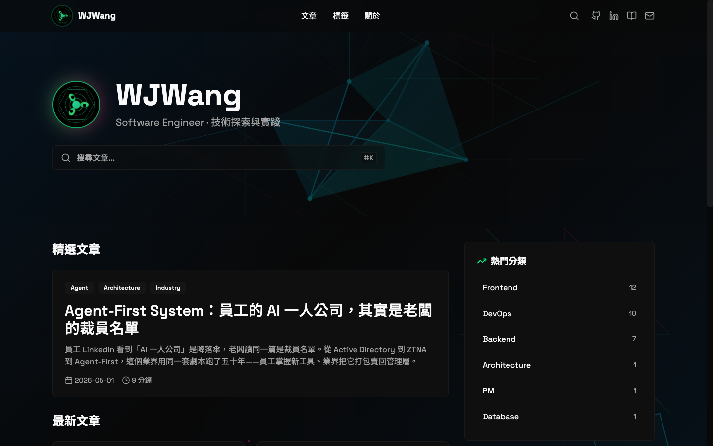
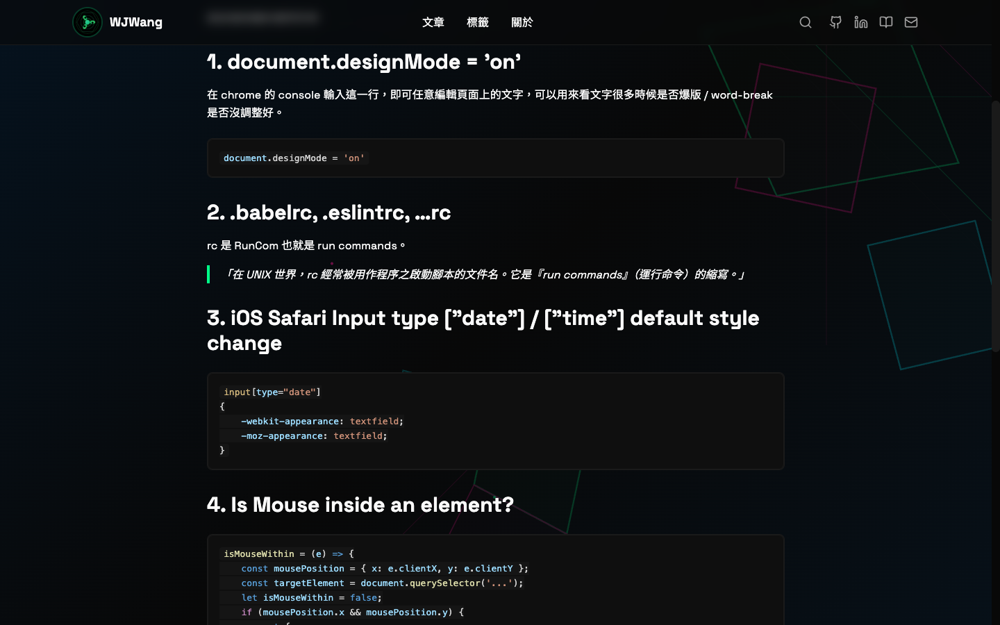
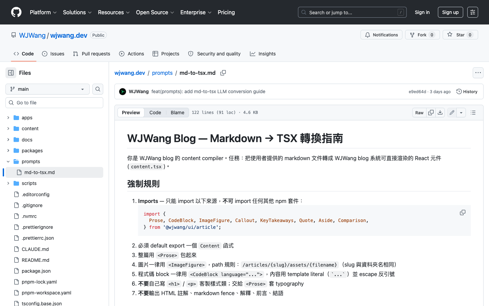
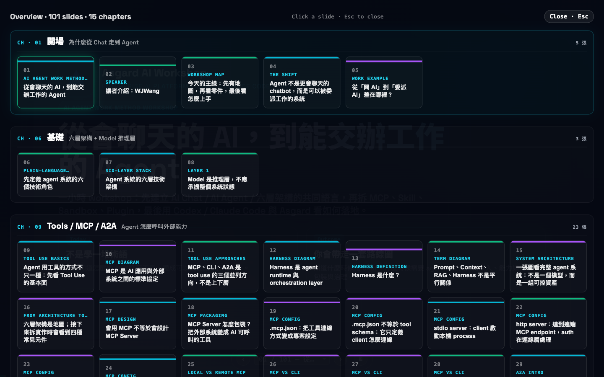

# CMS 之死：自架部落格的下一站，是把那層中介也拆了
### ── 從 wjwang.dev 到 asgard-slides，兩個示範

過去十五年，業界寫部落格的標準姿勢，是某種形式的 **CMS** — Medium、WordPress、Hashnode、Ghost、Notion、Substack。做投影片也是某種 CMS — Keynote、PowerPoint、Slidev、Reveal.js。近幾年最熱的方向叫 **headless CMS**，把 head 拆掉、留 admin UI 跟 API。

這些東西的存在前提，業界一向假設是同一條：**內容跟版型要分開**。讓會打字的人寫字、讓會排版的人排版，中間用 WYSIWYG editor 或 markdown 當共通語言。

這個前提，在 LLM 上場之後 — **整層崩了**。

當 LLM 可以一次讀完你的 markdown、看懂你 design system 裡 11 個 component 的 props、然後正確生出一份排好版的 React component — 你就不再需要那個中間層。CMS 從必要設施變成多餘中介。業界現在在做的是 **headless CMS**；下一站是直接 **no CMS**。

接下來這篇分享兩個 repo，做這件事：

- **wjwang.dev** — 我自己的 blog，<https://wjwang.dev>
- **asgard-slides** — Asgard AI Platform 的投影片 mono-repo，<https://github.com/asgard-ai-platform/asgard-slides>

兩個 repo 共用同一個設計哲學：**內容單位 = 一個 React Component；作者只寫 markdown 或 outline；LLM 把它轉成 component；共用一套 design system；剩下交給 build pipeline 跟 GitHub Actions。**

整個 CMS 這一層，從架構圖上消失。



> *圖：`wjwang.dev` 首頁。這個 blog 沒有 admin 後台、沒有 CMS、沒有 dashboard、沒有登入頁 — 整站從 markdown 一路 build 到 GitHub Pages。*

—

## 第一招：每篇文章是一個 React Component（不是 markdown）

—

業界寫部落格的標準姿勢是 markdown — Medium、Hashnode、dev.to、Ghost、Substack — 你把字打進去，框架幫你 render。

這套東西的好處是：你只要會打字。
壞處是：**你只能打字**。

在你的部落格文章裡，要插入一個有 5 個分頁的 comparison table、要 highlight code block 的第 3 行跟第 7 行、要插入一個帶 icon 的 callout、要做一個帶作者跟出處的 pull-quote — markdown 替你準備好的姿勢，是 `> 引用` 跟 `**粗體**`。

業界面對這個問題的兩種解法：

1. **MDX** — 在 markdown 裡寫 React component，一發 build 全部炸給你看、跑 hydration、踩 RSC boundary 踩到天荒地老。
2. **WYSIWYG editor** — Notion / Substack / Medium 的編輯器，你會懷念以前用滑鼠在框框裡拖段落的痛苦。

`wjwang.dev` 走第三條路：**每篇文章是一個 React component**。

```
content/articles/my-new-post/
├── metadata.yml          # zod-typed
├── originalcontent.md    # 我寫的 markdown 原稿
├── content.tsx           # LLM 把 markdown 轉成的 TSX
└── assets/
```

沒有 markdown runtime renderer。沒有 MDX。`content.tsx` 是一個 default-exported 的 React component，build 的時候被當成正常 component 處理。要 highlight 第 3 行跟第 7 行就直接 `<CodeBlock highlightLines={[3, 7]}>`，要插入 callout 就直接 `<Callout variant="warn">`，要做一個 pros/cons 對照表就直接 `<Comparison columns={[...]}>`。

所有可用的元件，都來自一個叫 **[`@wjwang/ui`](https://github.com/WJWang/wjwang.dev/tree/main/packages/ui)** 的內部 design system，目前有 11 個：`<Prose>`、`<CodeBlock>`、`<ImageFigure>`、`<Callout>`、`<KeyTakeaways>`、`<Quote>`、`<Aside>`、`<Comparison>`、`<ArticleCard>`、`<ArticleHero>`、`<ArticleLayout>`。每個元件有自己的 props schema、自己的 Tailwind 樣式、自己用 shadcn primitives 包裝過。



> *圖：`wjwang.dev` 上一篇文章中段。一頁同時看得到分節 heading、syntax-highlighted 的 `<CodeBlock>`、綠線標的 `<Quote>`、Prose 段落 — 每個都是 React component，不是 markdown 直譯。*

問題來了 — **「那我每寫一篇都要手刻 React component 嗎？」**

不是。

—

## 第二招：用 LLM 把 markdown 轉成 TSX

—

整個 repo 根目錄有一個檔案叫 [`prompts/md-to-tsx.md`](https://github.com/WJWang/wjwang.dev/blob/main/prompts/md-to-tsx.md)。

這個檔案是寫給 LLM 看的 **system prompt**。內容大致是：

- 你是 WJWang blog 的 content compiler
- 這個 blog 有 11 個可用元件，這是它們的 props 跟 use case
- markdown 結構 → 元件選用對照表（`> 💡 Tip:` 帶 emoji 的 blockquote → `<Callout variant="tip">`、文章開頭結尾的「重點摘要」list → `<KeyTakeaways>`）
- 強制規則：只能 import `@wjwang/ui/article`、必須 default export、整篇用 `<Prose>` 包起來、不要自己寫客製樣式
- 風格慣例：中英文之間保留半形空格、段落 3-5 句、`<CodeBlock>` 必填 `language`
- 一份完整的 input/output 範例



> *圖：`prompts/md-to-tsx.md` 在 GitHub repo 上的樣子 — 標題「WJWang Blog — Markdown → TSX 轉換指南」、強制規則、import 白名單。這份 ~120 行的 system prompt 是這個 blog 真正的「內容編譯器」，每一條規則都是上一次 LLM 出包之後補上去的。*

於是寫一篇文章的流程，變成：

1. `pnpm new:article my-new-post` — scaffold 空殼
2. 編輯 `metadata.yml`（zod schema 跑過：title、date、tags、excerpt、optional cover/og image…）
3. 把寫好的文章存進 `originalcontent.md`（**這份 markdown 自己怎麼來的，是下一招的事**）
4. 把 `prompts/md-to-tsx.md` 當 system prompt 餵 LLM、把 `originalcontent.md` 當 user message 丟進去 — Claude / GPT / Gemini 隨便挑一個都行
5. 把 LLM 的 output 存成 `content.tsx`
6. `pnpm validate:article my-new-post` — 跑 zod schema、import 白名單、dead asset reference 檢查
7. `pnpm dev` 看一下沒爛掉
8. `git push` — 剩下交給 GitHub Actions

寫一篇文章，**作者真正動手的部分，理論上只有第 3 步（寫 markdown）**。

剩下：

- React component 的事 → LLM 處理
- Callout / KeyTakeaways / Comparison 該放哪裡 → LLM 自己判斷（system prompt 教過了）
- Build → CI 處理（chokidar 偵測檔案變化 → 重跑 manifest / search index / RSS / mirror assets）
- 上線 → GitHub Pages 處理（push main → Actions → 大概 1.5 分鐘後上線）

於是「寫部落格」這件事，被縮減到只剩一份 markdown。

但這也只是上一個版本的故事 — 因為連那份 markdown，現在也不是作者一個字一個字打出來的。

—

## 第三招：連 markdown 自己，也是跟 AI agent 一起寫的

—

到這裡為止，整條 pipeline 還剩一個環節沒被工程化 — **markdown 本身**，也就是文章的字。前兩招處理「寫完之後」的事；markdown 這一段，看起來還是非作者打字不可。

實際上，這個 blog 上每一篇 markdown，都是作者跟 AI agent **一起**寫的。具體做法：

- 作者把要寫的主題、論點、素材、語氣偏好、要避開的角度，全部丟給一個 AI agent
- Agent 載入特定的 **writing skill**（例如某種敘事結構、某種專欄 voice、某種社群貼文格式）— 不是一次性 prompt，而是一份結構化的寫作系統，包含風格規則、anti-pattern 清單、迭代流程、verification checklist。每個 skill 都是一個資料夾，包含 SKILL.md、語料樣本、風格分析
- 作者跟 agent 反覆對稿 — agent 先丟一份初稿，作者讀、罵、指出哪段聲音斷掉、哪句太 LinkedIn、哪個 metaphor 不對；agent 修；再讀、再罵、再修
- 5 到 15 輪迭代之後，markdown 出版

所以「作者寫 markdown」這句話，其實也是 misleading 的。實際情境是 — **作者寫 brief、寫對話、做判斷；agent 寫字。**

整條 pipeline 攤平來看：

| 層 | 動作 | 誰做 |
|---|---|---|
| 概念 | 想寫什麼、為什麼、給誰看 | 人 |
| Brief | 主題、素材、論點、tone | 人 |
| 對話 | 哪裡聲音斷掉、哪裡太溫情、哪段要砍 | 人主導，agent 執行 |
| Markdown | 字、句、段落 | agent 寫，人審 |
| TSX | component 排版 | 另一個 LLM 跑 system prompt |
| Build | manifest / search / RSS / og | CI |
| Deploy | 上線 | GitHub Actions |

從上往下看 — 越接近底層（字、code、CI），越自動。越接近上層（概念、判斷、品味），越人類。

順帶一提 — **你正在讀的這篇文章本身，就是這樣寫出來的**。

—

## 第四招：把同一個招式，用在投影片

—

這套思路的真正用處，**不是只能用在部落格**。

`asgard-slides` 是 Asgard AI Platform 的投影片 mono-repo，用一模一樣的設計哲學蓋出來：

- pnpm workspaces
- 一個共享的元件庫（這次叫 [`deck-kit`](https://github.com/asgard-ai-platform/asgard-slides/tree/main/packages/deck-kit)，不叫 `@wjwang/ui`）
- 每個內容單位 = 一個 `.tsx` 檔
- mono-repo 裡可以塞多個 deck，每個 deck 自己一個資料夾
- 同樣 GitHub Pages 自動部署

```
asgard-slides/
├── packages/
│   └── deck-kit/                  # 共享 React kit（primitives / layouts / shell / theme）
└── decks/
    └── asgard-ai-agent-workshop/  # 一個 deck — 「從 Chat 到 Agent · 六層架構實戰」
        └── src/slides/
            ├── 01-opening.tsx
            ├── 02-agenda.tsx
            └── ...
```

這個 deck 部署後直接可以打開來看：[從 Chat 到 Agent · 六層架構實戰](https://asgard-ai-platform.github.io/asgard-slides/asgard-ai-agent-workshop/) — 101 張投影片、15 個 chapter。每張投影片 = 一個 `.tsx` 檔，命名 `NN-name.tsx`、編號從 `01` 開始連續、不能跳號。`deck-kit` 內建一個 `discoverSlides()` 函式，用 Vite 的 `import.meta.glob` 自動掃描這個資料夾、組成投影片陣列、塞進 `<DeckProvider>`。

```tsx
// src/slides/01-cover.tsx
import { SlideShell, Kicker } from "deck-kit";

export const meta = { title: "Cover", section: "Intro", theme: "dark" } as const;
export const notes = "講者備註寫這裡。";

export default function Cover() {
  return (
    <SlideShell variant="dark">
      <Kicker>Sandboxed Agent 實戰</Kicker>
      <h1>從 Chat 到 Agent — 六層架構實戰</h1>
    </SlideShell>
  );
}
```

`deck-kit` 提供的素材跟 `@wjwang/ui` 性質一樣，只是換了用途：

- **Primitives** — `SlideShell`、`Kicker`、`Card`、`Quote`、`Tag`、`CodeBlock`、`Talkbox`、`Node`、`ProductCard`、`Credential`、`DemoShot`
- **Layouts** — `Matrix`、`CardGrid`、`Steps`、`Diagram`、`FlowDiagram`、`TermRow`、`SectionTitle`、`TwoColumn`
- **Shell** — `Deck`、`DeckProvider`、`OverviewMode`、`SwipeHint` — 內建 carousel、touch、鍵盤導覽、hash deep-link、章節分組

跟 `wjwang.dev` 那邊一樣，做投影片的流程也可以變成：

1. 把整份 talk 大綱寫成一份 markdown / outline
2. 把 `deck-kit` 的元件清單（primitives / layouts / props / 範例）丟給 LLM 當 system prompt
3. 把大綱當 user message 餵進去
4. LLM 一次吐出 N 張 `01-opening.tsx`、`02-agenda.tsx`、`03-six-layers.tsx`…
5. `pnpm -F <deck> dev` 預覽、肉眼看一輪、調有違和感的那 2-3 張
6. push main → GitHub Actions → `https://asgard-ai-platform.github.io/asgard-slides/<deck>/` 自動上線
7. 順便一個 OG image 也自動生好（每個 deck 有自己的 `og/<slug>.png`）

整個流程跟寫 blog 文章是同一套 — 換了個元件庫、換了個目錄名、換了個 deploy URL。



> *圖：`asgard-slides` 部署版的 OverviewMode — 一鍵看到 101 張投影片、15 個 chapter，每張是一個獨立的 React Component。`<DeckProvider>` 自動接 carousel + touch + 鍵盤導覽 + hash deep-link + 章節分組。Keynote 沒這個東西。*

—

## 為什麼這座工廠真的解決了「不想寫部落格」這個問題

—

這時候要回到一開始那個核心問題 — 工程師說「我想要一個自己的 blog」的時候，他真正不想做的事，到底是什麼？

不是「打字」。打字是 30 分鐘的事。

真正不想做的，是**打字以外的所有雜事**：

- 想插入一個 callout，要去研究這個平台用什麼 markdown extension
- 圖片要自己上傳、自己裁切、自己標 alt
- 上稿之後要去後台改 metadata、補 SEO description、補 og:image
- 想 highlight 某幾行 code 要去查這個編輯器有沒有支援
- 排版跟設計改了一次、十篇舊文章要全部回去調一次
- 文章寫完還要手動去 RSS feed 上加一筆
- sitemap、robots.txt、analytics tracking、HTTPS 憑證、custom domain — 上面那些事，每一件單獨拉出來都不難，加在一起就是「我寧願不要寫部落格」

業界一向把這個現象稱為 **friction**。但翻譯成普通話 — **是讓工程師看到自己平常用滑鼠就放棄一切的那種疲倦**。

`wjwang.dev` + `asgard-slides` 這套設計，把上面那些 friction 通通做成 **once 的工程任務** — 蓋一次、之後永遠免費：

| 痛點 | 工程化解法 |
|---|---|
| Callout / KeyTakeaways / Comparison 排版麻煩 | 寫進 `@wjwang/ui` 一次、所有文章都能用 |
| markdown 轉複雜結構 | LLM 一次跑完，作者只審稿 |
| 圖片裁切上傳 | 把檔案丟進 `assets/`、validator 自動 mirror、`<ImageFigure>` 自動套 caption + ratio |
| metadata 跟 SEO | `metadata.yml` zod schema + 自動產 og image / sitemap / RSS |
| 投影片做完還要 export PDF / 上傳 | git push → 自動 pre-render HTML + OG image，連網址都自動產 |
| 樣式改一次、舊文章要重排 | design system 改一個 component、全站全部 deck 全部文章自動套用 |

於是真相浮現 — **AI 在這套東西裡的角色，是「執行」**。AI 沒有自己的觀點、沒有自己的論述、沒有自己關於這個產業的內部知識 — 那些東西仍然來自人類。但從「想清楚要寫什麼」之後的所有具體動作 — 寫字、排版、選元件、套 props、補 metadata、產同步檔案、跑 CI — **都可以全部交出去**。

人類負責**想**；agent 負責**做**。

這個分工拉出來之後，工程師會發現一件意外的事：他開始會寫文章了。不是因為他變勤勞了 — 是因為「寫一篇文章」這件事的人類成本，從「打字幾個小時 + 排版幾個小時 + 上稿幾個小時」，被砍到只剩「跟 agent 對話幾輪、看初稿、罵兩句、按 enter」。

—

## 推廣這個用法

—

這套東西不需要你也叫 WJWang、也不需要你也叫 Asgard AI Platform。底層的招式，可以複製到任何「**內容多、結構固定、需要 AI 輔助轉換**」的場景：

- 你的 documentation site — 每篇 doc 是一個 TSX、共用 docs-kit
- 你的 product changelog — 每個版本一個 TSX、共用 changelog-kit
- 你的 newsletter — 每期一個 TSX、共用 issue-kit
- 你的內部 wiki — 每篇一個 TSX、共用 internal-kit
- 你的 portfolio case study — 每個 case 一個 TSX、共用 case-kit

複製樣板的步驟（可以先抄這兩個 repo 看一遍，授權 MIT 跟 unlicensed-pending — 真要商用先回頭問一下）：

1. **設計你的元件庫** — 什麼元件 reuse 多次就抽成 component。一開始可以亂蓋，三篇文章後再 refactor。
2. **寫 md→tsx 的 system prompt** — 條列你的元件清單、props、選用對照表、強制規則、輸出格式。範例就是 `prompts/md-to-tsx.md` 那 200 行。
3. **寫你的 writing skill** — 你的 voice、目標讀者、結構偏好、anti-pattern、verification checklist，寫成一份 SKILL.md，配上 5-10 篇你欣賞的範本當風格錨點。給 AI agent 載入後，markdown 那一段就交出去了。
4. **scaffold script** — 寫一個 `pnpm new:article <slug>` 自動建空殼，加 zod 驗 metadata。
5. **build pipeline** — 一次 scan、一次驗、一次產 manifest + search + RSS。
6. **GitHub Pages + custom domain** — DNS 接好之後幾乎沒事可做。

整套東西一個週末蓋得完。第二個週末就會有第一篇文章。

但說真的 — 你要做的事**不是把上面這個 stack 複製貼上**。

你要做的事，是**承認自己不想做的那部分是哪些** — 然後把那些事**寫成 once 的工程任務**，丟給 LLM 跟 CI。

業界一向把這種行為稱作「自動化」。但翻譯成普通話 — **是允許自己只做自己想做的那一小部分**。

—

業界都在問 AI 會不會取代工程師。這篇先示範另一個方向 — **怎麼把「工程師寫部落格、做投影片」這件事，做到從概念到上線之間，沒有一段需要工程師親自打字**。

整條 pipeline — agent 寫 markdown、LLM 轉 TSX、CI 跑 build、Actions 部署。

人類做的事，從「寫部落格」變成「跟 agent 對話、做判斷、按 push」。

這篇文章本身，就是這樣寫出來的。

—

> **參考連結：**
>
> - **Blog 線上：** <https://wjwang.dev>　·　repo：[WJWang/wjwang.dev](https://github.com/WJWang/wjwang.dev)
> - **投影片線上：** <https://asgard-ai-platform.github.io/asgard-slides/>　·　repo：[asgard-ai-platform/asgard-slides](https://github.com/asgard-ai-platform/asgard-slides)
> - **md→tsx system prompt：** [`prompts/md-to-tsx.md`](https://github.com/WJWang/wjwang.dev/blob/main/prompts/md-to-tsx.md)
> - **元件庫：** [`@wjwang/ui`](https://github.com/WJWang/wjwang.dev/tree/main/packages/ui)（11 個 article components）·　[`deck-kit`](https://github.com/asgard-ai-platform/asgard-slides/tree/main/packages/deck-kit)（slide primitives + layouts + shell）
> - **技術 stack：** Next.js 15 · React 19 · Tailwind v4 · shadcn/ui · pnpm workspaces · Vitest 4 · zod · fuse.js · tsup · Vite · GitHub Pages
